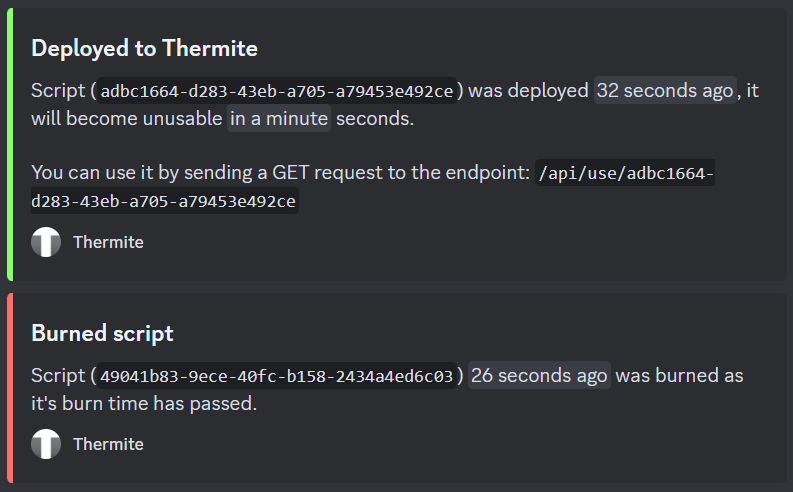

# Thermite

**Disposable account-less one-time use script loading service with memory-only storage and a RESTful API for Roblox**

## Run, build and test Thermite

First time clone? Use this command: 
```bash
chmod +x ./setup.sh ; ./setup.sh
```

To build and run Thermite for testing, use the following command: 
```bash
npm run builderman
```

To build Thermite, use the following command: 
```bash
npm run build
```

To start Thermite, use the following command: 
```bash
npm run start
```

## Using the Thermite API to deploy your first disposable script

JavaScript example using Axios:
```js
const axios = require("axios");

axios.post("http://localhost:3000/api/deploy", { // You can also append the "burnTime" query parameter to the URL to specify a custom burn time in milliseconds (When the script will be self-destructed)
	script: `print("Hello, world!")`
}).then((res) => {
	console.log(res.data);
}).catch((err) => {
	console.error(err);
});
```

Response: 
```javascript
{
	"message": "Script deployed",
	"burnTime": "100000",
	"scriptId": "573469c9-3a9f-467b-aba2-ed7e052e31df"
}
```

## Reading the script

JavaScript example using Axios:
```js
const axios = require("axios");

axios.get("http://localhost:3000/api/use/573469c9-3a9f-467b-aba2-ed7e052e31df").then((res) => {
	console.log(res.data);
}).catch((err) => {
	console.error(err);
});
```

Response: 
```lua
print("Hello, world!")
```
If the deployed script is deleted, this response will be returned instead: 
```javascript
{
	"error": "Script not found"
}
```

> **Note**: 
> The script will be automatically deleted after the burn time has passed (Default burn time is 120 seconds), or if the script is used once.
> Another thing to note is that if the fetch succeeds, the Content-Type will be `text/plain`, otherwise it will be `application/json`.

## Using Discord Webhooks with Thermite

Thermite supports Discord Webhooks, which means that you can get notified when a script is deployed, used or deleted. You will need to append the `webhookUrl` query parameter to the URL when deploying a script.

JavaScript example using Axios:
```js
const axios = require("axios");

axios.post("http://localhost:3000/api/deploy?webhookUrl=WEBHOOK-FULL-URL-HERE", {
	script: `print("Hello, world!")`
}).then((res) => {
	console.log(res.data);
}).catch((err) => {
	console.error(err);
});
```


